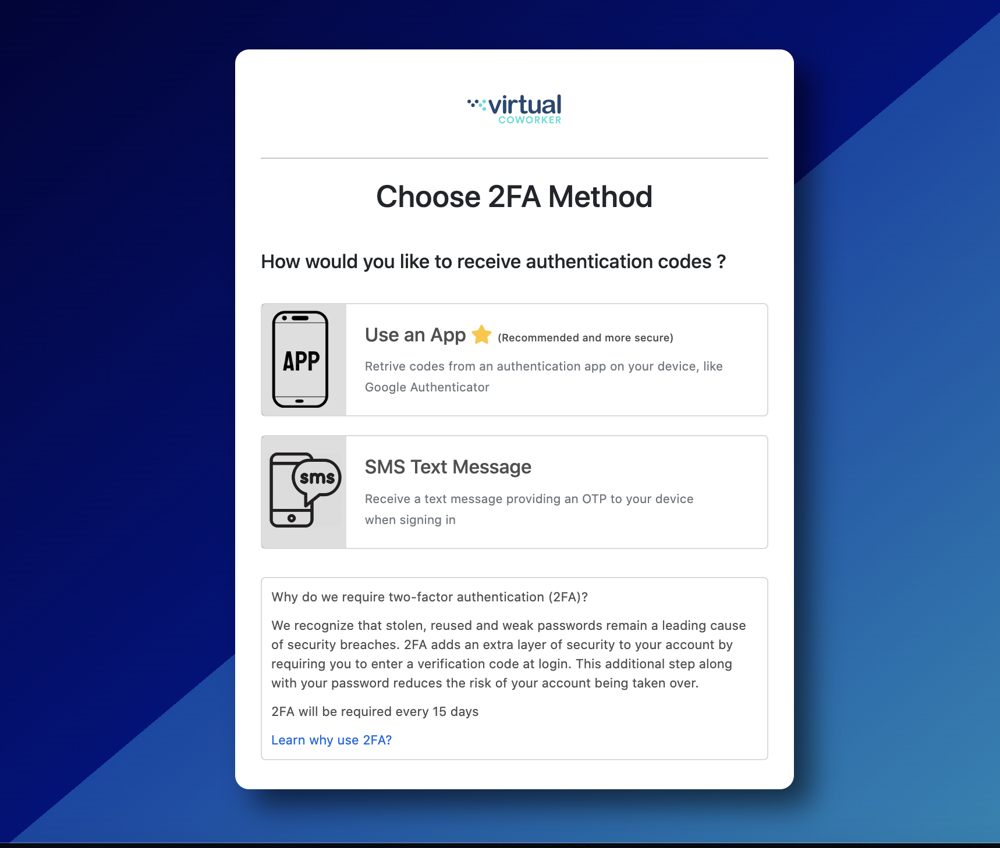

## Introduction
Documentation to get you up to speed on the ins and outs of the Web Admin Application.

Aside from this documentation, If you are a developer and a contributor of the codebase,
You can run the application locally and access more on the code-level documentation and go to `localhost:3000/docs`. The docs are generated from YARD https://yardoc.org/

## Table of Contents

- [Dependencies](#dependencies-and-libraries)
- [Overview](#overview)
- [Sign Now Integration](#sign-now-integration)
- [Xero Integration](#xero-integration)
- [Invoices](#invoices)
- [Automated Payment Integration](#automated-payment-integration)
- [Payslips](#payslips)
- [Time Tracking](#time-tracking)
- [2FA](#2fa)
- [Refunds](#refunds)
- [Common Troubleshooting](#common-troubleshooting)
## Dependencies and Libraries
The Admin Application is a Full Stack Ruby on Rails Application.

`As of Oct 2022`
- Programming Language: Ruby 3.0.3
- Framework: Ruby on Rails 6.1.4
- Database: PostgreSQL
- Background Processing: Sidekiq
- In Memory Data Store: Redis
- Frontend Framework: Hotwire/Turbo
- CSS Framework: Bootstrap 5
- Cloud Service: Heroku
- Monitoring: Rollbar
- S3 Bucket: Digital Ocean
- Authentication: Devise
- Email Delivery: Sendgrid
- SMS Delivery: Twilio

## Overview
The Virtual Coworker Admin Application handles everything from start to finish. Meaning from Onboarding and Ending Staff and Client Engagements. Once you view the Codebase it would be like a can of worms. But mainly there are 3 objects were the application revolves on, `Contractor`, `Client` and `Invoices`. These Objects are pretty self explanatory but let's start with how are we onboarding new Staff or `Contractors`


Pretty simple but this is only a summarized version of the flow. To explain a bit further, It all starts with the Client. So technically and business logic speaking, Clients can have many Staff or Contractors.
So if a Client already exists in our Application e.g he/she wants to add a new staff, Will go to the next step of creating a `Contractor` Record.

In a Business Flow, Everything starts with a NHI (New Hire Information) which is submitted by our Recruiters. And that NHI data is turned to a `Contractor` Record in our Application.
Once we've created a Contractor Record, We will then send contracts via [SignNow](https://www.signnow.com/) which is also handled within our Application

For each New Contractor or Staff that we have, We send in 2 documents or contracts to say. 1 for the Staff and 1 for the Client.
1. Contractor Agreement
2. Client Services Agreement

So this will always apply for every new contractor. Even if the Client has more than 1 staff already.
And to take note, We don't store card details to our application, Though we store the CVV/Card Code but we encrypt it first before storing it to our database. And the rest of the card details are then stored to our third party payment providers

And once these documents are signed, We then proceed to creating an Initial Invoice to the Client. So this would be an Invoice for a month's pay for the Contractor/Staff


And once paid, We send in onboarding emails to our Clients and to our new Staff and that finishes the onboarding process.

## Sign Now Integration
The application utilize from a bunch of Third Party Providers and SignNow is our provider that we leverage for document/contracts sending and signing. SignNow has a public API that
we can view [SignNow](https://docs.signnow.com/docs/signnow/YXBpOjQwMDY0MDM3-api-reference/). But mainly these are the endpoints that we are using

1. [Documents](https://docs.signnow.com/docs/signnow/0a2c8b01c93dc-get-document) (Fetch, Download, Prefill)
2. [Invite to Sign](https://docs.signnow.com/docs/signnow/5732b1c14fd97-send-an-invite-to-sign-freeform-or-field) (Send an Invite, Resend Email Invite)
3. [Template](https://docs.signnow.com/docs/signnow/4369f9b844ed7-get-document-out-of-template) (Create Document out of Template)

Everything starts with the Template. We have templates for the Contracts that we are sending on a day to day basis. But one of the challenges in ther API is that there is no way
to fetch all of the existing templates that our SignNow account has.

To be able to integrate it with our application, We created a new Database table called `SignNowTemplate` which will hold the template name and the template_id from SignNow. In that way we
can get the details of that template using the fetch document endpoint from their API

Once a template is selected, We then create a document/contractor out of that template. And creating the sending the document is 3 way process
1. Create document out of template
2. Prefill document (With data based from our Contractor Record)
3. Send Email Invite

Once we already gone through this process, We then just monitor the documents through our application. And all unsigned contracts are always fetched directly from SignNow API to ensure
that we always have to up-to-date data and status of that document.

The goal was to have the exact same thing (but better and faster) that was present on the SignNow Dashboard into our application. Because at the end we want that our application will be the centralized source of data.


## Xero Integration
Another Third Party Provider that we have is [Xero](https://xero.com/) and to keep it short, This is for Accounting and mainly Invoices

So each Invoice that we create in our application, Is then synced to Xero. And the syncing process goes on both ends. Meaning any changes from Xero is also synced to our application. This happens via a background worker that we ran every hour to sync our recent updated or created invoices from Xero.

Aside from Invoices, We also create and sync our Client Records from our appliaction to Xero.

Luckily on this one, Xero provides a Ruby library that we can utilize for our integration that you can view [here](https://github.com/XeroAPI/xero-ruby). Won't be explaining much further on this one since the link provided will give all information you need for authorization and communicating with their API.

Importantly to take note, Our application has two `Companies` record, Virtual Coworker PTY and Virtual Coworker LLC. To put it simply
1. `Virtual Coworker PTY -> AU and NZ Clients`
2. `Virtual Coworker LLC -> US and EU Clients`

And those companies exists in Xero as their own separate organization. So that every Invoice will go to their respective Organization.

To summarize, These are the things we do in Xero
1. Create Invoices from Web Admin to Xero (And Syncing)
2. Creating Invoice Notes for Invoices (To act as history on what are the things that had been done, like email was sent, was approved etc.)
3. Creating Payments (When Invoices were paid via our Third Party Payment Provider e.g Bpoint)
4. Creating Client Records from Web Admin to Xero (And Syncing)

Another thing to take note that, For Invoices, Xero will always be the source of truth. So everytime we create or update an Invoice in our application we always follow what Xero computed. One of the reasons is that for PTY Invoices, Every Invoice will have a GST (10%) addition. And a challenge on our end was it was quite hard to identify the behavior of Xero on how it computed GST. To resolve it, We would always let Xero be the source of truth. You would often see a code like this on invoice creation
```
invoice.save # We save it in our database
invoice.create_xero # We then sync the created record to Xero
invoice.update_from_xero # Then we fetch the record created from Xero and update our own record with it
```

One thing out of scope for now, That is still being done in the Xero Dashboard is reconcilation of payments since currently there is no API endpoint for it.

## Invoices
We've already discussed about the Initial Invoice which was mentioned above. But after that, Then what? What we do is we create Invoices in Batch every month. This would be a regular schedule
1. Batch Invoices are created every 1st day of the month
2. Batch Invoices are then send to the client via email within the 1st and 5th day of the month
3. Batch Invoices are then processed for payment every 5th day of the month

Batch Creation of Invoices is then grouped by timezone. Because we are working with multiple clients across the globe, We would want to create Invoices within 12am - 2am of the Clients Time
You can check out the `GenerateBatchInvoicesByTimezoneWorker` class to dig deep on how we generate invoices.

This happens in a monthly basis and this is how we mainly bill our clients.

So let's say a Batch Invoice is already paid. What do we do with overtime requests? We then create a LAH (Late Additional Hours) Invoice.

In our Codebase, We have an `OvertimeApprovalRequest` table which stores all OT requests of our Contractors. And we then create an LAH Invoice for those overtime approval request given some certain criteria
which you can then view on that Model/Table.

The Invoice Lifecycle would be
1. Draft
2. Approved
3. Paid

So every Invoice created will always be in Draft status. So these allows customization of the invoices or any request for change by the client
Once everything is settled, We then approve the Invoice. This will mainly mark that the Invoice is ready for payment.
And after being approved, It will then be processed for payment via our application and will be explained more below.

Another thing is every changes in the Invoice is recorded in our application. And we utilize the ActiveSnapshot Ruby Library for that.
And every change in the Invoice is already recorded to Xero which in called a Payment History in Xero which looks something like this in Code
```
def create_invoice_history_in_xero(details:)
  xero_invoice_history_args = [
    company.xero_tenant_id,
    xero_invoice_id,
    {
      history_records: [
        { user: 'Virtual Coworker - Web Admin', details: details }
      ]
    }
  ]

  XeroApiClient.create_invoice_history(company: company, args: xero_invoice_history_args)
end
```

Aside from Batch Invoices, We also create different kinds of invoices like NOR, BOND and etc.

## Automated Payment Integration
Now that we have Invoices and an Accounting Service via Xero, Then probably we should also have a way to pay those invoices. Currently as of Oct 2022 these are our payment providers
1. Bpoint
2. AuthorizeNet
3. Ezidebit

For Bpoint and AuthorizeNet. We use an HTTP client to communicate with their API
For Ezidebit, Quite different because they are still using Web Services thus using XML. And We are communicating with their API via Savon for the SOAP Api

And within our application, We also have integrations for these 3 Payment Providers. But still, These payment providers follow all the same process flow. To explain briefly, These are the steps conducted before an Invoice is actually paid

1. Invoice Created (Draft)
2. Invoice is sent to the client via Email
3. Invoice is then approved (Status changed to Approved to our application and in Xero)
4. Invoice is now processed for payment

And now the payment process consists of these steps

1. Process Payment via Third Party Provider e.g Bpoint
2. Create an Invoice History Note in Xero
3. Create a Batch Payment Record in Xero (This stores the transaction from the Third Party Provider and marks the Invoice as Paid In Xero)

Same with Invoices, Every Payment Transaction that we do will always be recorded either it was a success or a failed transaction for Tracking purposes and these happens both in our application and in Xero.

## Payslips
The application handles both external and internal staffs.
For internal staffs, Payroll is conducted every 16th and 1st day of the month.
For External staffs, Payroll is conducted once a month every 21st of the month

We handle the creation, sending and creating PDF files for these payslips.

And in Payroll creation, We don't only include the staffs logged hours. We also consider allowances and loans from our Staffs

And also for Allowances, We also allow either a recurring allowance (like food allowance) that is added to the staffs payroll everytime and a one-time allowance like bonuses and etc.


But as of now processing payroll is handled outside of our application via Wise

## Time Tracking

We handle our staff's Time Tracking. And we do it using Worksnaps. Each staff is required to install the Worksnaps desktop application to track their time at work. And what we do in our application, Is fetch those time entries from Worksnaps -> our Application. We utilize Heroku Scheduler and run a Sync Worker every hour, That will sync our staff's time entries to our application.

And we apply rules on our staff's logged hours. So it will all depend on the staff's required hours of work. So let's say Staff A has logged 8 hours of work in Worksnaps. But in the application, he/she is only
required to work for 6 hours a day. We then only logged 6 hours of work for that day for Staff A.

Any overtime should be requested by Staff. And those overtime approval request will require the approval of their client.

## 2FA
To provide a secured application to our users, We are implementing Two Factor Authentication. So each user has a choice between two 2FA methods, One is App Authentication and other is SMS Authentication. And we the required 2FA every 30 days.



For App Authentication, We provide sets of mobile authenticators to choose from that they can use.
For SMS Authentication, We then use Twilio as an SMS Service for sending authentication codes via SMS. And we support mobile numbers from different parts of the world

## Refunds
Everything always comes to an end. And lets say a contractor engagement has been cancelled, What happens next ? We then create a `Refund` record for that staff and its client

Now in our applicaiton, This is will be always created automatedly whenever a client engagement has been cancelled. This is to provide refund to the Client's previously paid Invoice and a way to create a final pay/payslip for the contractor/staff.

Take note that even if there's no actual refund for the Client's Invoice e.g The staff ended at the last day of the month which ensures that everything paid by that client for that Staff was actually used, We still create the Refund record for tracking and also to enable creation of the final pay of the staff

And since we have an Integration for our Invoice Payments, We also have an automated integration within our application to process Refunds. But before we process the Refund, A refund should be approved by the client. This would be the process flow

1. Refund record is created and reviewed
2. Refund details is sent to the client via email which contains a refund approval email
3. Refund should be approved by the Client
4. Refund is then processed via our application
5. Refund is sent to client notifying them that the refund is already processed.

Now why do we need the Refund to be approved by the client ? Because we want to ensure and remind them that if they want to directly hire the staff, They should pay a certain fee based on their initial contract from the start.


## Common Troubleshooting

- One of the most common issues occuring is Xero Authentication. Rarely happens mostly every 2 months onwards. So this issue occurs when the authorization grant has expired which causes all API calls to Xero to invalid and returns a 404.
Troublesome issue but can be resolved easily by reauthenticating our Xero account via the Web Admin. Just go to Company Setting and go to both VC Inc and PTY respectively. And on each company page just click on the Xero Accounting Link to
reauthenticate our Xero accouunt to resolve the issue


Once we've reauthenticated our Company accounts to Xero, Then the issue will be resolved

- Another Issue encountered is when our SignNow account has changed password, Thus it will result to issues with our API Integration with SignNow. Since API Authorization requires username and password of our SignNow Account.
When this happens, We just need to go to our Heroku Dashboard and update our ENV Variables for SIGNNOW_USERNAME and SIGNNOW_PASSWORD.

- With AuthorizeNet Payments, We often receive a FDC Omaha error when we try to process payments. Quite a weird issue but incase you've encountered this one, The Payment just needs to be reprocessed and on the second try, It will succeed.
Now why does it succeeds on the second try ? Strangely when we receive a FDC Omaha Error, The resolve is not to pass the CVV to the payment request. You will see something like this
```
if invoice.client.card_code.present? && %w[217 200].exclude?(invoice.payment_transaction_logs.last&.api_response_code)
  transaction_request.profile.paymentProfile.cardCode = Encryption.decrypt(invoice.client.card_code)
end
```

So 217 and 200 API response codes from AuthorizeNet represent the FDC Omaha Error. And whenever the last transaction log has a FDC Omaha Error, We just skip sending the CVV to the payment request which then resolves the issue

- When the application is slowing down, Most often we just reboot our Heroku Dynos with `heroku restart -app vc-xero`. Currently as of Oct 2022, We are running on a 1 GB memory Dyno and 1 Puma Worker with 8 Threads and with our current user traffic that is mostly sufficient enough.

## Contributing

Updates on this Cheatsheet are welcome. This documentation is intended to be a safe, welcoming space for collaboration, and contributors are expected to adhere to the Contributor Covenant code of conduct.